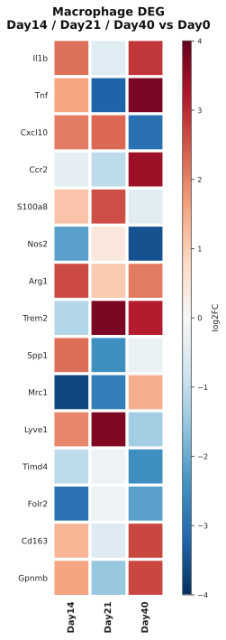
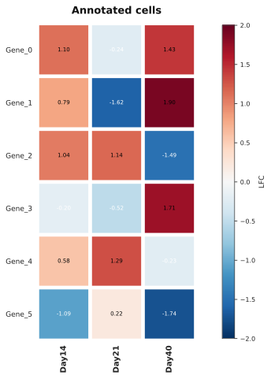
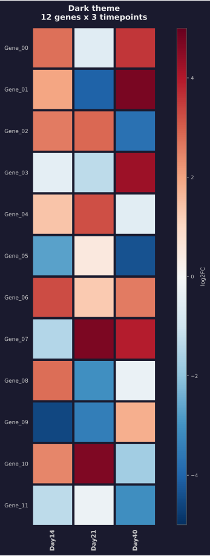
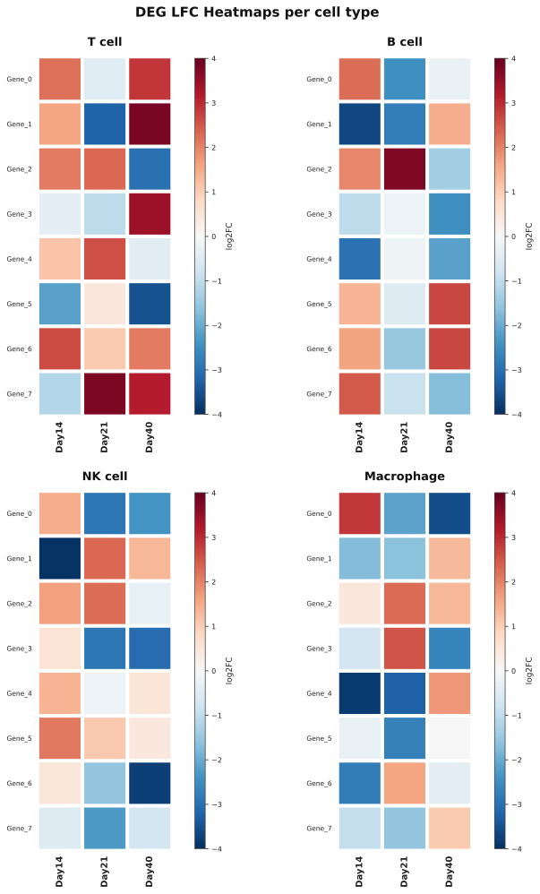
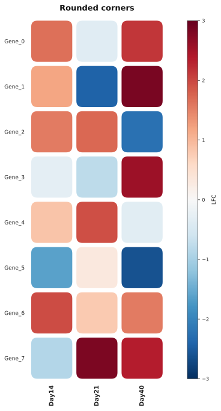
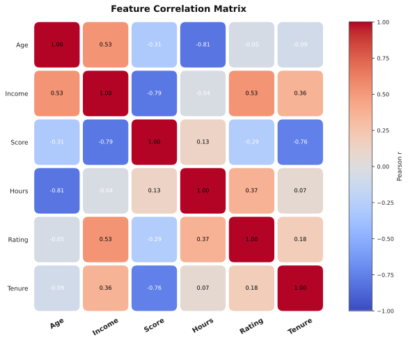
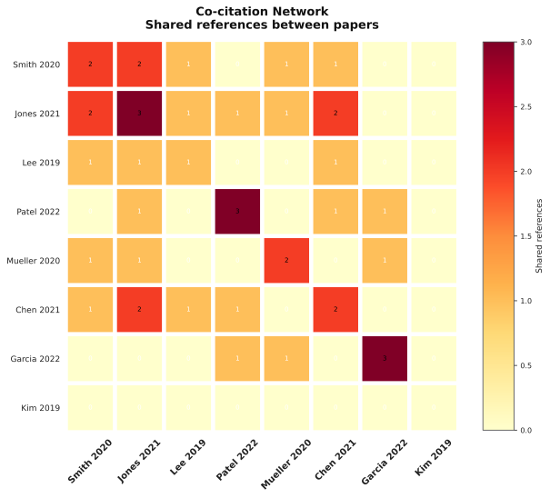
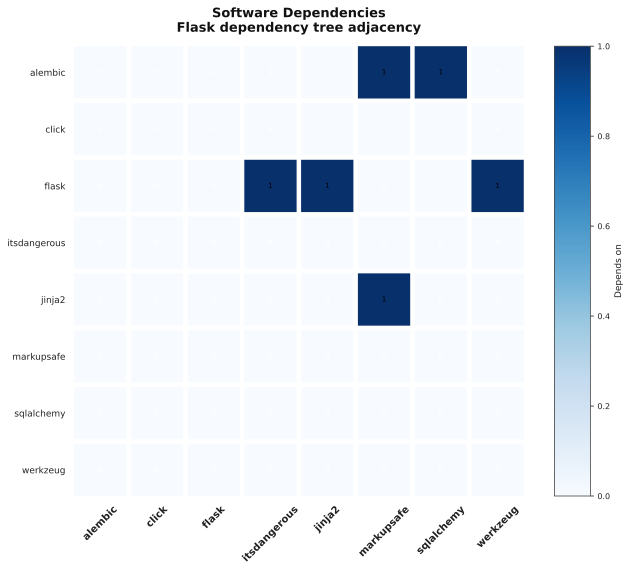
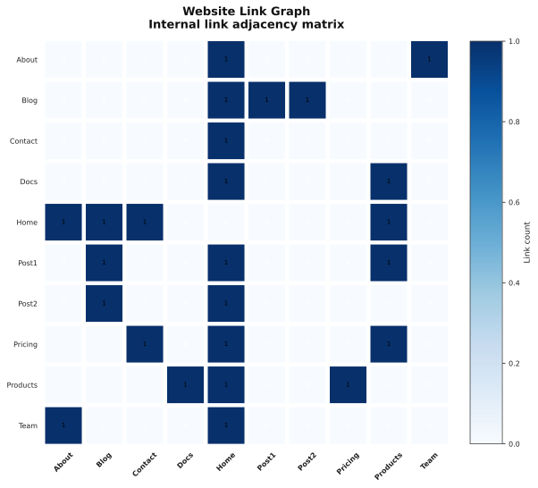

# Examples

All runnable scripts are in the [`examples/`](../examples/) directory. Generate every output at once:

```bash
cd examples && python generate_all.py
```

## Index

| # | File | Description |
|---|------|-------------|
| 01 | `01_from_matrix.py` | Basic matrix input with custom style |
| 02 | `02_from_dataframe.py` | Pandas DataFrame input |
| 03 | `03_top_n_rows.py` | Automatic top-N row selection |
| 04 | `04_annotated.py` | Cell value annotations |
| 05 | `05_sig_mask.py` | Significance markers with sig_mask |
| 06 | `06_grid.py` | Multi-panel grid layout |
| 07 | `07_rounded.py` | Rounded cell corners |
| 08 | `08_dark_theme.py` | Dark background theme |
| 09 | `09_citation_network.py` | Citation co-citation matrix preset |
| 10 | `10_dependencies.py` | Software dependency adjacency preset |
| 11 | `11_pipeline.py` | ETL pipeline connectivity preset |
| 12 | `12_correlation.py` | Feature correlation matrix |
| 13 | `13_survey.py` | Likert-scale survey results |
| 14 | `14_model_comparison.py` | ML model benchmarks |
| 15 | `15_webgraph.py` | Website link graph preset |
| 16 | `16_dense_microarray.py` | Dense microarray-style tiny cells |

## Previews

### Basics

| From matrix (`01`) | Annotated (`04`) | Dark theme (`08`) |
|---|---|---|
|  |  |  |

### Layouts & Style

| Grid (`06`) | Rounded (`07`) | Correlation (`12`) |
|---|---|---|
|  |  |  |

### Presets

| Citations (`09`) | Dependencies (`10`) | Web graph (`15`) |
|---|---|---|
|  |  |  |
